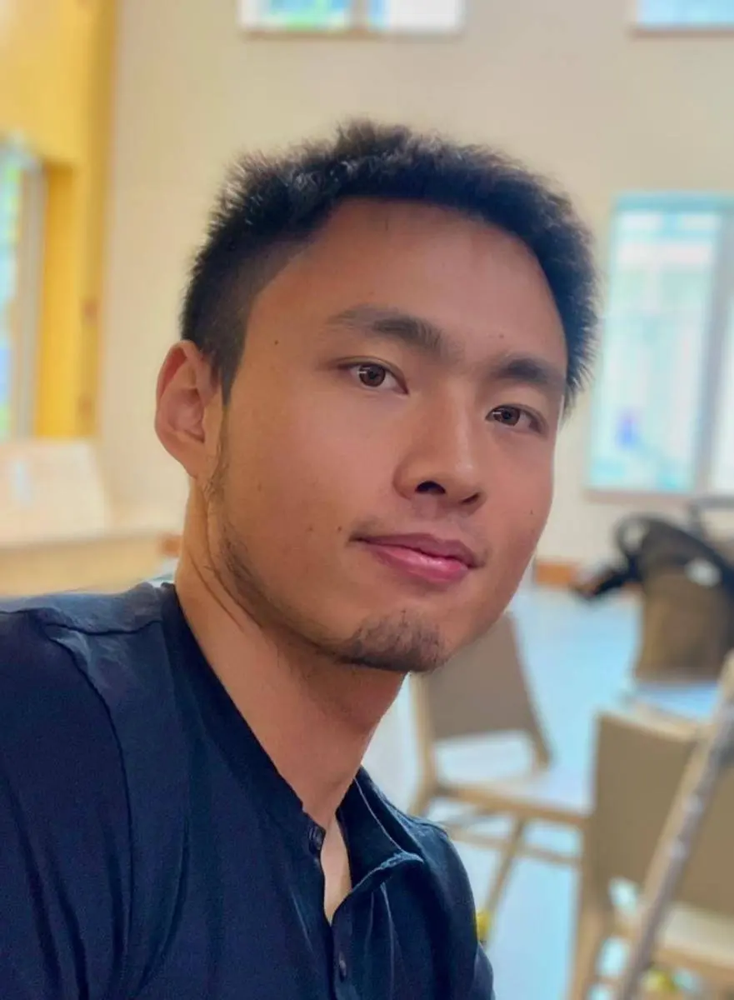
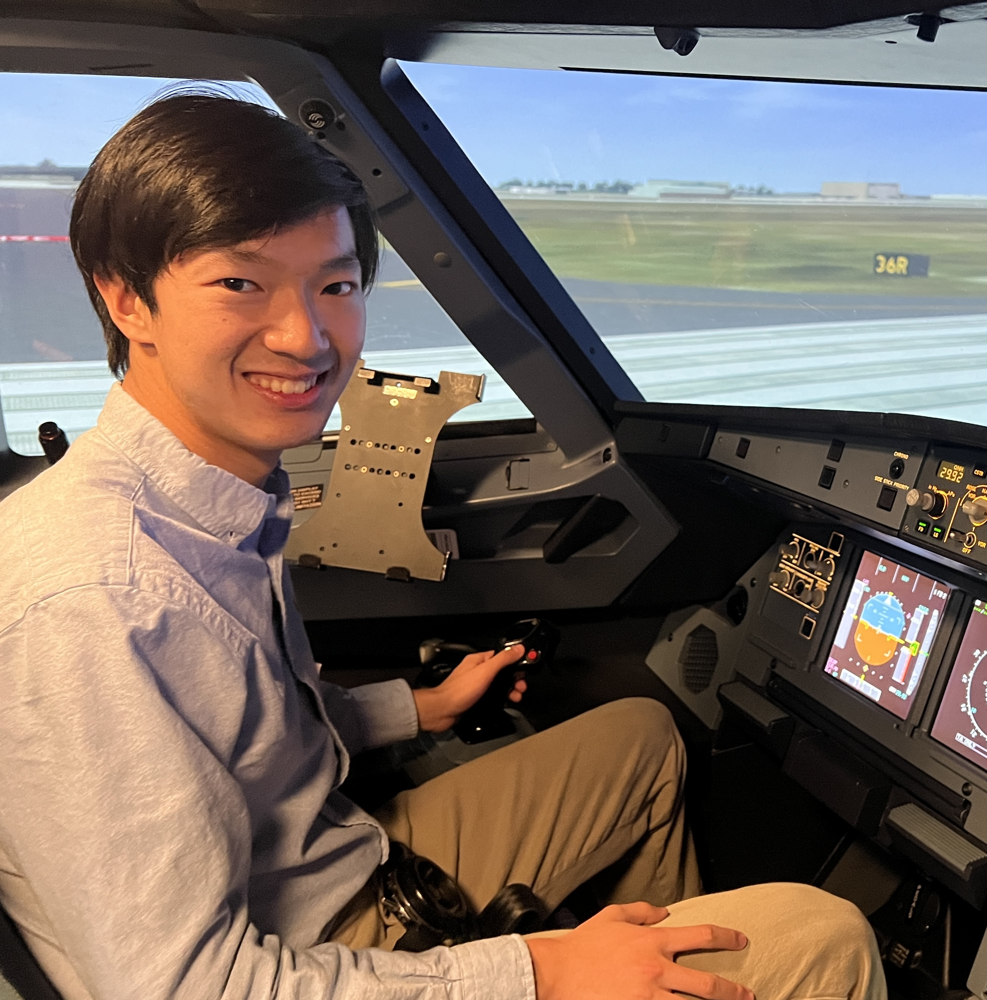
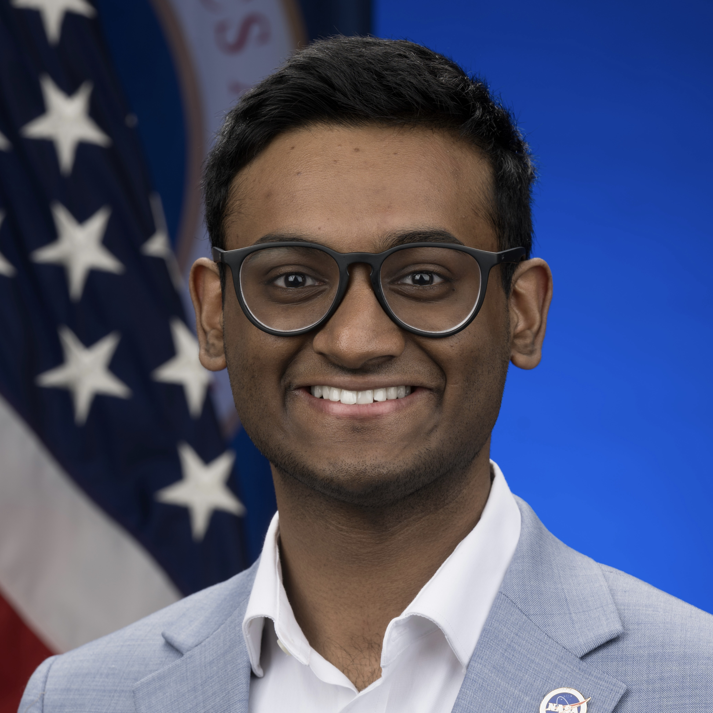
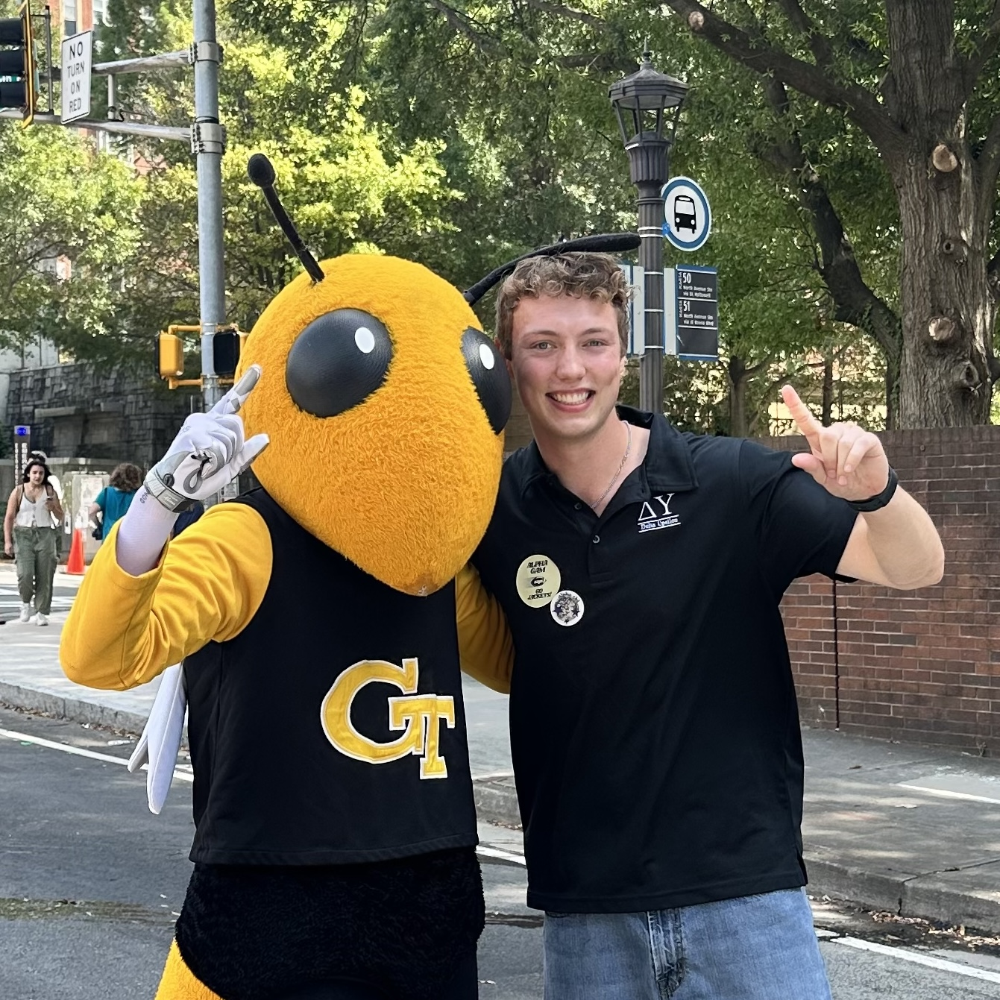
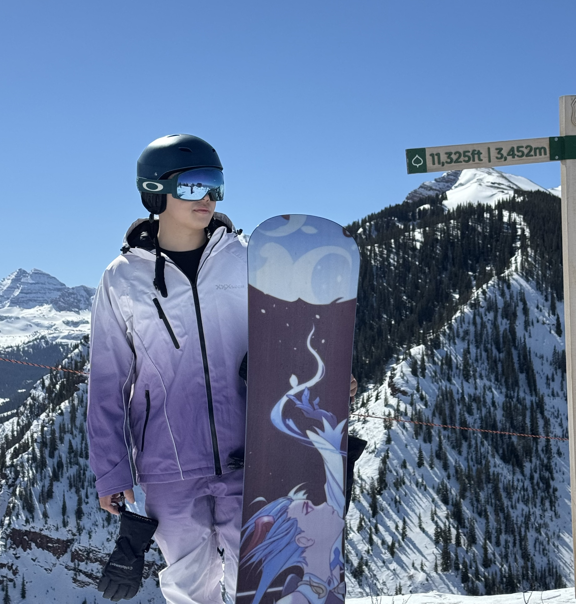
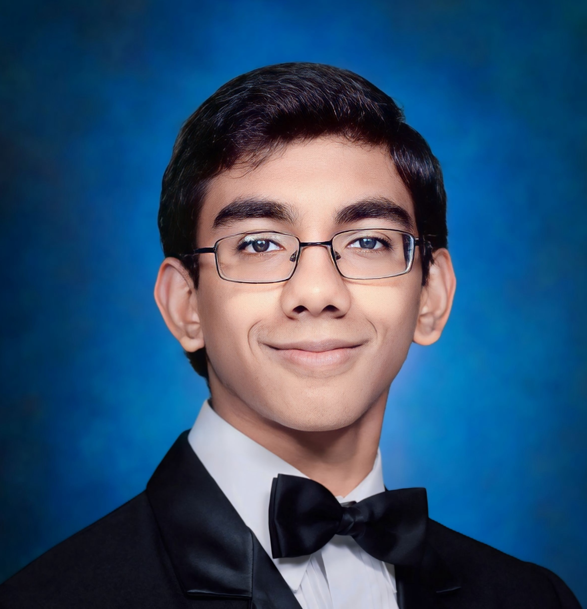
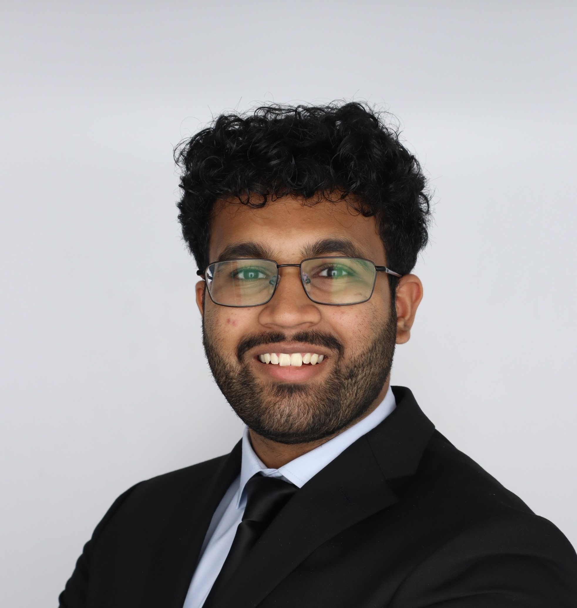
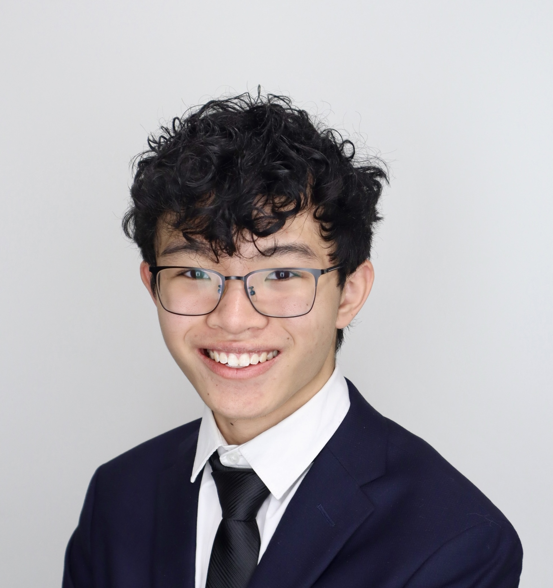
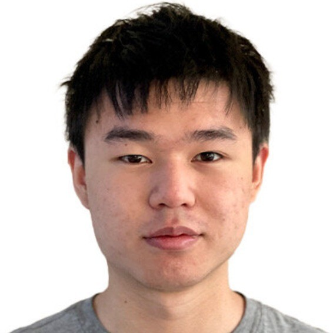

---
# A Demo section created with the Blank widget.
# Any elements can be added in the body: https://wowchemy.com/docs/writing-markdown-latex/
# Add more sections by duplicating this file and customizing to your requirements.
# **Specialties:** Architected Materials (Metamaterials), Design Algorithms, Responsive Materials
widget: blank  # See https://wowchemy.com/docs/page-builder/
headless: false  # This file represents a page section.
# weight: 20  # Order that this section will appear.
title: "People"
subtitle: ""
design:
  columns: '1'
advanced:
  css_class: people-wide
---
## **Principal Investigator**

  

    
  

  

    
Dr. Bolei Deng (邓博磊)

    

      <strong>Assistant Professor</strong>, Georgia Institute of Technology
    

    

      <strong>Office:</strong> Weber 219 
      <strong>Email:</strong> <a href="mailto:bolei.deng@gatech.edu">bolei.deng@gatech.edu</a>
    

    

      <strong>Postdoc</strong>, MIT (2022-2023)
    

    

      <strong>Ph.D.</strong>, Harvard University (2016-2021)
    

    

      <strong>B.S.</strong>, Zhejiang University (2012-2016)
    

  

<!-- Bolei joined the Daniel Guggenheim School of Aerospace Engineering at Georgia Institute of Technology as an Assistant Professor in December 2023 ([<ins>Georgia Tech AE Directory<ins>](https://ae.gatech.edu/directory/person/bolei-deng)). He earned his Ph.D. in Mechanical Engineering from Harvard University in 2021 under the guidance of [<ins>Professor Katia Bertoldi<ins>](https://bertoldi.seas.harvard.edu/) (Disseratation: [Flexible Mechanical Metamaterials: Solitary Waves and Phase Transitions](Deng_dissertation2021.pdf)). He conducted postdoctoral research at MIT's Computer Science and Artificial Intelligence Laboratory (CSAIL) with [<ins>Professor Wojciech Matusik<ins>](https://cdfg.mit.edu/) and at the department of Mechanical Engineering with [<ins>Professor Xuanhe Zhao<ins>](http://zhao.mit.edu/). For more details, please refer to [Projects](../projects), [Publications](../publications), and his [<ins>Google Scholar profile<ins>](https://scholar.google.com/citations?user=F4YFjy8AAAAJ&hl=en&oi=ao). -->
<!-- His research during this period include the application of artificial intelligence and machine learning in material structure design, metamaterials based robotics, fracture theory in polymer systems, wearable devices, and medical health. He has published 30 academic papers in top international journals, including *Nature*, *PNAS*, *Physical Review Letters*, *Advanced Materials*, *Nature Communications*, and *Science Advances*, with 17 of them as the first or co-first author. Additionally, two of his research contributions have been accepted by top computer science conferences, *ICML* and *Siggraph*.  -->

## **PhD Students**

  

    
    
Xinyi Yang

    
PhD in Robotics

    

      My research focuses on developing new mechanical mechanisms through design, rapid prototyping, and experimental validation for adaptive robotic and aerospace systems. Outside the lab, I enjoy opera, documentaries, exhibitions, and exploring artistic practices.
    

    

      Office: Weber 201 
      Email: <a href="mailto:xyang626@gatech.edu">xyang626@gatech.edu</a> 
      Website: <a href="https://xinyiyang0.github.io/">xinyiyang0.github.io</a>
    

    

      MS, Harvard University 
      BS, South China Agricultural University
    

  

  

    
    
Kyungmi Na (羅憼美)

    
PhD in Machine Learning

    

      My work is related to the intersection of artificial intelligence and physical intelligence. Currently, I'm focused on bringing physical intelligence to life through metamaterials, specifically by developing new design methodologies that leverage differentiable simulation. I am trying to find ways to make materials “smarter” through computational design.
    

    

      Email: <a href="mailto:kna35@gatech.edu">kna35@gatech.edu</a>
    

    

      MS, Aerospace engineering, KAIST 
      BS, Mechanical engineering, POSTECH
    

  

  

    
    
Miaomiao Dai

    
PhD in machine learning

    

      My research focuses on combining machine learning with physics-based modeling to uncover governing principles and enable inverse design of metamaterial systems. Beyond research, I enjoy hiking, photography, cooking, and discovering new restaurants.
    

    

      Office: Weber 201 
      Email: <a href="mailto:mdai49@gatech.edu">mdai49@gatech.edu</a>
    

    

      MS, Mechanical Engineering, Georgia Tech 
      BS, Biosystem Engineering, Zhejiang University
    

  

## **Undergraduate Students**

  

    
    
Leo Liu

    
Aerospace Engineering

    

      <a href="mailto:leo.liu@gatech.edu">leo.liu@gatech.edu</a>
    

  

  

    
    
Nikhil Iyer

    
Aerospace Engineering

    

      <a href="mailto:niyer45@gatech.edu">niyer45@gatech.edu</a>
    

  

  

    
    
Pete Etheredge

    
Aerospace Engineering

    

      <a href="mailto:etheredgepete@gatech.edu">etheredgepete@gatech.edu</a>
    

  

  

    
    
Ruike (Henry) Li

    
Physics

    

      <a href="mailto:rli368@gatech.edu">rli368@gatech.edu</a>
    

  

  

    
    
Jonathan Jimmy Varghese

    
Aerospace Engineering

    

      <a href="mailto:jvarghese62@gatech.edu">jvarghese62@gatech.edu</a>
    

  

  

    
    
Saahil Sujeet Gaonkar

    
Aerospace Engineering

    

      <a href="mailto:sgaonkar8@gatech.edu">sgaonkar8@gatech.edu</a>
    

  

  

    
    
Ethan Ting-Wei Koh

    
Aerospace Engineering

    

      <a href="mailto:ekoh31@gatech.edu">ekoh31@gatech.edu</a>
    

  

  

    
    
Weiting Qian

    
Aerospace Engineering

    

      <a href="mailto:wqian46@gatech.edu">wqian46@gatech.edu</a>
    

  

