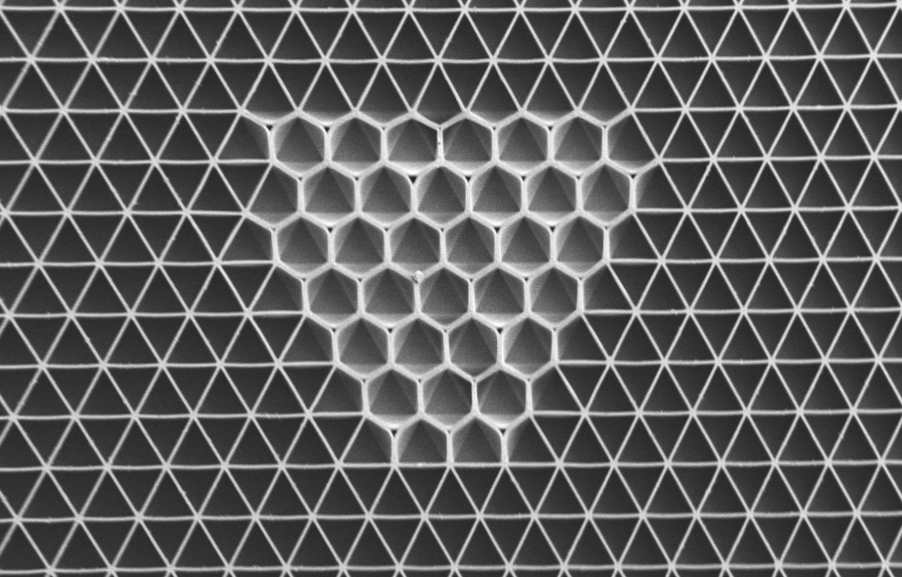

---
# Project landing page (custom content only).
type: page
layout: page
title: Projects
subtitle:
---

<a href="project/inverse-design/" style="text-decoration:none; color:inherit; display:block;">

  
Optimization and Inverse Design of Metamaterials

  
  

    We develop optimization and inverse design algorithms that connect target mechanical responses to metamaterial geometry, enabling fast discovery of high‑performance architectures.
  

  
Selected publications

  

    1. Beichen Li, Bolei Deng, Wan Shou, Tae-Hyun Oh, Yuanming Hu, Yiyue Luo, Liang Shi, Wojciech Matusik (2024).&nbsp;<a href="../publication/li-2024-computational/"><strong>Computational discovery of microstructured composites with optimal stiffness-toughness trade-offs</strong></a>. <em>Science Advances</em>. 
    2. Yunya Liu, Pai Wang, Christian Kern, Bolei Deng (2024).&nbsp;<a href="../publication/liu-2024-multi/"><strong>Multi-mode extremal architected materials with cubic symmetry</strong></a>. <em>Behavior and Mechanics of Multifunctional Materials XVIII</em>. 
    3. Arash Kazemi, Kshiteej J Deshmukh, Fei Chen, Yunya Liu, Bolei Deng, Henry Chien Fu, Pai Wang (2023).&nbsp;<a href="../publication/kazemi-2023-drawing/"><strong>Drawing dispersion curves: band structure customization via nonlocal phononic crystals</strong></a>. <em>Physical Review Letters</em>. 
    4. Liane Makatura, Bohan Wang, Yi-Lu Chen, Bolei Deng, Chris Wojtan, Bernd Bickel, Wojciech Matusik (2023).&nbsp;<a href="../publication/makatura-2023-procedural/"><strong>Procedural Metamaterials: A Unified Procedural Graph for Metamaterial Design</strong></a>. <em>ACM Transactions on Graphics</em>. 
    5. Bolei Deng*, Ahmad Zareei, Xiaoxiao Ding, James C. Weaver, Chris H. Rycroft, Katia Bertoldi* (2022).&nbsp;<a href="../publication/deng-2022-inverse/"><strong>Inverse Design of Mechanical Metamaterials with Target Nonlinear Response via a Neural Accelerated Evolution Strategy</strong></a>. <em>Advanced Materials</em>.
  

</a>

<a href="project/fracture/" style="text-decoration:none; color:inherit; display:block;">

  
Fracture of Metamaterials

  

    <video src="project/fracture/featured.mp4" autoplay loop muted playsinline style="width:100%; display:block;"></video>
  

  

    We study how mechanical metamaterials with complex geometry fracture, especially for these askin to polymer ntworks. These insights guide scalable design rules for tougher, more resilient materials.
  

  
Selected publications

  

    1. Chase M Hartquist, Shu Wang, Bolei Deng, Haley K Beech, Stephen L Craig, Bradley D Olsen, Michael Rubinstein, Xuanhe Zhao (2025). <a href="../publication/hartquist-2025-fracture/"><strong>Fracture of polymer-like networks with hybrid bond strengths</strong></a>. <em>Journal of the Mechanics and Physics of Solids</em>. 
    2. Chase Hartquist, Shu Wang, Qiaodong Cui, Wojciech Matusik, Bolei Deng, Xuanhe Zhao (2025). <a href="../publication/hartquist-2025-scaling/"><strong>Scaling law for intrinsic fracture energy of diverse stretchable networks</strong></a>. <em>Physical Review X</em>. 
    3. Shu Wang, Chase M Hartquist, Bolei Deng, Xuanhe Zhao (2024). <a href="../publication/wang-2024-loop/"><strong>A loop-opening model for the intrinsic fracture energy of polymer networks</strong></a>. <em>Macromolecules</em>. 
    4. Beichen Li, Bolei Deng, Wan Shou, Tae-Hyun Oh, Yuanming Hu, Yiyue Luo, Liang Shi, Wojciech Matusik (2024). <a href="../publication/li-2024-computational/"><strong>Computational discovery of microstructured composites with optimal stiffness-toughness trade-offs</strong></a>. <em>Science Advances</em>. 
    5. Bolei Deng, Shu Wang, Chase Hartquist, Xuanhe Zhao (2023). <a href="../publication/deng-2023-nonlocal/"><strong>Nonlocal intrinsic fracture energy of polymerlike networks</strong></a>. <em>Physical Review Letters</em>.
  

</a>

<a href="project/electronic-free/" style="text-decoration:none; color:inherit; display:block;">

  
Electronic-Free Systems

  

    <video src="project/electronic-free/featured.mp4" autoplay loop muted playsinline style="width:100%; display:block; border-radius:10px;"></video>
  

  

    Electronic systems often add fabrication cost, power requirements, and vulnerability—especially in harsh environments such as deep sea or space. We build mechanically encoded systems that enable communication, deployment, actuation, and sensing with minimal or no electronics through carefully designed architectures and geometry.
  

  
Selected publications

  

    1. Xinyi Yang, Bohan Wang, Víctor Riera Naranjo, Minghao Guo, Olivia Rivera, Leonid Sopizhenko, Shucong Li, William Freeman, Wojciech Matusik, Bolei Deng (2025). <a href="../publication/yang-2025-electronic/"><strong>Electronic-Free Particle Robots Communicate through Architected Tentacles</strong></a>. <em>Advanced Intelligent Systems</em>. 
    2. Yibo Fu, Vivian Shen, Víctor Riera Naranjo, Bolei Deng, Alex Adams, Josiah Hester (2025). <a href="../publication/fu-2025-soundoff/"><strong>SoundOff: Low-cost Passive Ultrasound Tags for Non-invasive and Non-Intrusive Smart Home Sensing</strong></a>. <em>Proceedings of the ACM on Interactive, Mobile, Wearable and Ubiquitous Technologies</em>. 
    3. Bolei Deng#, Mohamed Zanaty#, Antonio E Forte, Katia Bertoldi (2022). <a href="../publication/deng-2022-topological/"><strong>Topological solitons make metamaterials crawl</strong></a>. <em>Physical Review Applied</em>.
  

</a>

<a href="project/nonlinear-waves/" style="text-decoration:none; color:inherit; display:block;">

  
Nonlinear Waves in Metamaterials

  

    <video src="project/nonlinear-waves/featured.mp4" autoplay loop muted playsinline style="width:100%; display:block;"></video>
  

  

    We study how nonlinear waves travel through metamaterials and how geometry and nonlinear dynamics enable new mechanisms for control, focusing, and robust wave manipulation.
  

  
Selected publications

  

    1. Bolei Deng, Hang Shu, Jian Li, Chengyang Mo, Jordan R. Raney, Vincent Tournat, Katia Bertoldi (2023). <a href="../publication/deng-2023-nonlinear/"><strong>Nonlinear waves at the free surface of flexible mechanical metamaterials</strong></a>. <em>Applied Physics Letters</em>. 
    2. Bolei Deng#, Jian Li#, Vincent Tournat, Prashant K. Purohit, Katia Bertoldi (2021). <a href="../publication/deng-2020-dynamic/"><strong>Dynamics of mechanical metamaterials, A framework to connect phonons, nonlinear periodic waves and solitons</strong></a>. <em>Journal of the Mechanics and Physics of Solids</em>. 
    3. Bolei Deng, JR Raney, K Bertoldi, Vincent Tournat (2021). <a href="../publication/deng-2021-nonlinear/"><strong>Nonlinear waves in flexible mechanical metamaterials</strong></a>. <em>Journal of Applied Physics</em>. 
    4. Bolei Deng, Yuning Zhang, Qi He, Vincent Tournat, Pai Wang, Katia Bertoldi (2019). <a href="../publication/deng-2019-propagation/"><strong>Propagation of elastic solitons in chains of pre-deformed beams</strong></a>. <em>New Journal of Physics</em>. 
    5. Bolei Deng#, Chengyang Mo#, Vincent Tournat, Katia Bertoldi, Jordan R. Raney (2019). <a href="../publication/deng-2019-focusing/"><strong>Focusing and Mode Separation of Elastic Vector Solitons in a 2D Soft Mechanical Metamaterial</strong></a>. <em>Physical Review Letters</em>. 
    6. Bolei Deng, Vincent Tournat, Pai Wang, Katia Bertoldi (2019). <a href="../publication/deng-2019-a-95/"><strong>Anomalous Collisions of Elastic Vector Solitons in Mechanical Metamaterials</strong></a>. <em>Physical Review Letters</em>. 
    7. Bolei Deng, Pai Wang, Qi He, Vincent Tournat, Katia Bertoldi (2018). <a href="../publication/deng-2018656/"><strong>Metamaterials with amplitude gaps for elastic solitons</strong></a>. <em>Nature Communications</em>. 
    8. Bolei Deng, Vincent Tournat, Katia Bertoldi (2018). <a href="../publication/deng-2018-b-09/"><strong>Effect of predeformation on the propagation of vector solitons in flexible mechanical metamaterials</strong></a>. <em>Physical Review E</em>. 
    9. Bolei Deng, Jordan R. Raney, Vincent Tournat, K. Bertoldi (2017). <a href="../publication/deng-20179-e-0/"><strong>Elastic Vector Solitons in Soft Architected Materials</strong></a>. <em>Physical Review Letters</em>.
  

</a>

<a href="project/phase-transitions/" style="text-decoration:none; color:inherit; display:block;">

  
Phase Transitions in Metamaterials

  

    <video src="project/phase-transitions/featured.mp4" autoplay loop muted playsinline style="width:100%; display:block;"></video>
  

  

    We explore phase transitions and multistability in metamaterials, uncovering how geometry and instabilities enable reversible switching and programmable behavior.
  

  
Selected publications

  

    1. Nikolaos Vasios, Bolei Deng, Benjamin Gorissen, Katia Bertoldi (2021).&nbsp;<a href="../publication/vasios-2020/"><strong>Universally bistable shells with nonzero Gaussian curvature for two-way transition waves</strong></a>. <em>Nature Communications</em>. 
    2. Ahmad Zareei, Bolei Deng, Katia Bertoldi (2021).&nbsp;<a href="../publication/zareei-2020/"><strong>Harnessing transition waves to realize deployable structures</strong></a>. <em>Proceedings of the National Academy of Sciences</em>. 
    3. Bolei Deng#, Siqin Yu#, Antonio E. Forte, Vincent Tournat, Katia Bertoldi (2020).&nbsp;<a href="../publication/deng-2020-characterization/"><strong>Characterization, stability, and application of domain walls in flexible mechanical metamaterials</strong></a>. <em>Proceedings of the National Academy of Sciences</em>. 
    4. Bolei Deng, Pai Wang, Vincent Tournat, Katia Bertoldi (2019).&nbsp;<a href="../publication/deng-2019-nonlinear/"><strong>Nonlinear Transition Waves in Free-standing Bistable Chains</strong></a>. <em>Journal of the Mechanics and Physics of Solids</em>. 
    5. Ahmad Rafsanjani, Lishuai Jin, Bolei Deng, Katia Bertoldi (2019).&nbsp;<a href="../publication/rafsanjiani-2019-propagation/"><strong>Propagation of pop ups in kirigami shells</strong></a>. <em>Proceedings of the National Academy of Sciences</em>.
  

</a>

<a href="project/soft-robots/" style="text-decoration:none; color:inherit; display:block;">

  
Soft Robots via Metamaterials

  
  

    We create soft robotic functions using metamaterials, leveraging nonlinear responses to achieve motion, crawling, and programmable shape change.
  

  
Selected publications

  

    1. Bolei Deng#, Mohamed Zanaty#, Antonio E. Forte, Katia Bertoldi (2022).&nbsp;<a href="../publication/deng-2022-topological/"><strong>Topological solitons make metamaterials crawl</strong></a>. <em>Physical Review Applied</em>. 
    2. Bolei Deng, Liyuan Chen, Donglai Wei, Vincent Tournat, Katia Bertoldi (2020).&nbsp;<a href="../publication/deng-2020-pulse/"><strong>Pulse-driven robot, Motion via solitary waves</strong></a>. <em>Science Advances</em>. 
    3. Lishuai Jin, Antonio Elia Forte, Bolei Deng, Ahmad Rafsanjani, Katia Bertoldi (2020).&nbsp;<a href="../publication/jin-2020/"><strong>Kirigami‑Inspired Inflatables with Programmable Shapes</strong></a>. <em>Advanced Materials</em>. 
    4. Ahmad Zareei, Bolei Deng, Katia Bertoldi (2019).&nbsp;<a href="../publication/zareei-2020/"><strong>Harnessing transition waves to realize deployable structures</strong></a>. <em>Proceedings of the National Academy of Sciences</em>.
  

</a>

<a href="project/micro-structures/" style="text-decoration:none; color:inherit; display:block;">

  
Micro-structures with Responsive Materials

  
  

    We develop responsive micro-structures that can transform and self-regulate, creating adaptive material systems with rich mechanical and functional behaviors.
  

  
Selected publications

  

    1. Shucong Li, Michael M. Lerch, James T. Waters, Bolei Deng, Reese S. Martens, Yuxing Yao, Do Yoon Kim, Katia Bertoldi, Alison Grinthal, Anna C. Balazs, Joanna Aizenberg (2022).&nbsp;<a href="../publication/li-2022-self/"><strong>Self-regulated non-reciprocal motions in single-material microstructures</strong></a>. <em>Nature</em>. 
    2. Shucong Li#, Bolei Deng#, Alison Grinthal, Alyssha Schneider-Yamamura, Jinliang Kang, Reese S. Martens, Cathy T. Zhang, Jian Li, Siqin Yu, Katia Bertoldi, Joanna Aizenberg (2021).&nbsp;<a href="../publication/li-2021-liquid/"><strong>Liquid-induced topological transformations of cellular microstructures</strong></a>. <em>Nature</em>.
  

</a>

